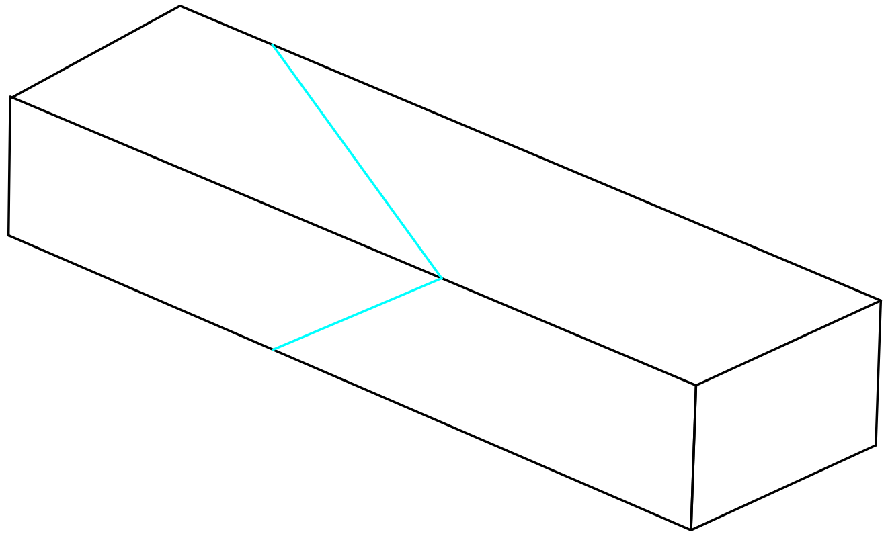
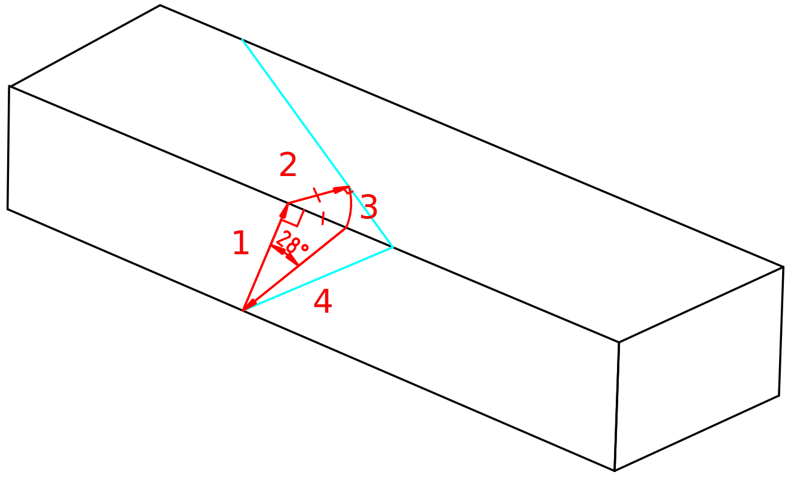

Coupe avec une circulaire
=========================

Réalisation d'une coupe avec angle sur 2 faces à la circulaire

Étapes pour trouver le nouvel angle de coupe
--------------------------------------------

Il faut débuter par identifier la face telle que les 2 coupes soient vers la
gauche (réglage circulaire oblige)

1) Renvoyer le point sur la face (perpendiculairement à l'arête) 
2) Renvoyer le point obtenu perpendiculairement à l'autre plan de coupe
3) Renvoyer la longueur obtenue sur l'arête précédente
4) Nouvel angle de coupe

