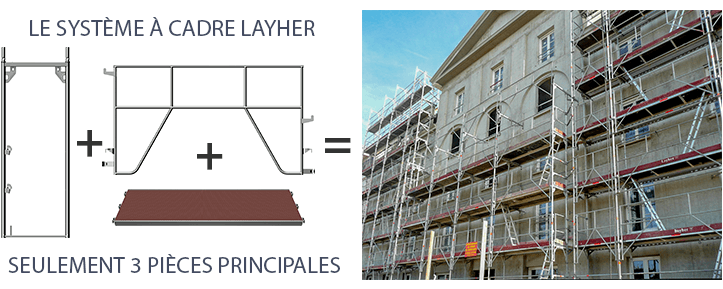
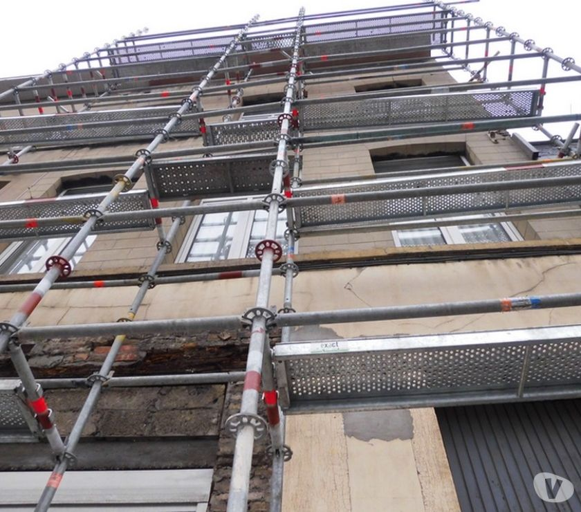
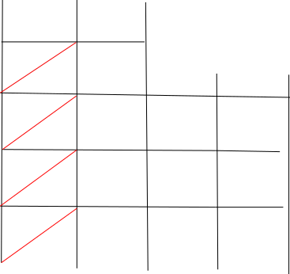
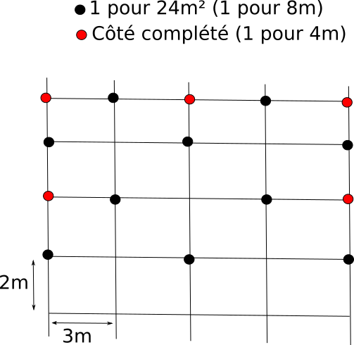

Échafaudage
===========

Dates
-----

Depuis 1991, l'employeur a une obligation de s'assurer de la sécurité de ses
employés et de fournir les moyens associés.

Depuis 1993, l'EPI doit être fourni par l'employeur.

2001, introduction du Document unique. Document créé pour représenter les
risques présents au sein de l'entreprise et les moyens mis en oeuvre pour les
éviter. Document rédigé par le chef d'entreprise. 5000e d'amende si manque.

RCPro: L'employeur est responsable de la sécurité de ses employés.

R408 Avril 2007, référence du montage d'échafaudage en sécurité (sans exposition
au vide).

12 niveaux max, plans prévus par le constructeur. Au delà, demander un calcul.

Vérifications échafaudage
-------------------------

- Mise en service (formation spéciale)
- Journalière (visuelle, en accord avec la mise en service. Faisable par un
  simple monteur).
- Trimestrielle, pour les échafaudages à demeure.

Risques et dangers
------------------

- Chute personnes: lisses/sous-lisses (à chaque niveau)
- Chute objets: plinthe (à chaque niveau)
- Renversement: points d'ancrage
- Effondrement: Contreventement (diagonales, plateaux, cadres)

2 types d'échafaudages
----------------------

- à cadre (structure contreventée dans le plan transversal)

- multidirectionnel (possibilités N directions depuis un noeud)

Distances à respecter en bas de pente
-------------------------------------

- 20 cm de la façade: si plus, obligation garde corps intérieur
- 80 cm sous bas de pente
- filet si toit > 60degrés

Contreventement
---------------

Règle: Une travée contreventée pour 3 libres

Ancrage
-------

- Reprise pour effort du vent, ainsi que protection contre renversement.
- Chaque ancrage doit tenir 300daN (300kg) à l'arrachement

1 Ancrage pour 24m2 (hauteur entre deux niveaux = 2m, longueur plateaux = 3m)

Si filet, 1 ancrage pour 12 m2.

Placer les ancrages en quinconce, puis en ajouter à chaque niveau sur les côtés.

Charge
------

Charge de service inscrite sur les plateaux (par m²).

6 classes de structure:

- 1: 75kg/m²
- 2: 150kg/m²
- 3: 200kg/m²
- 4: 300kg/m²
- 5: 450kg/m²
- 6: 600kg/m²

Charge d'exploitation (charge réelle)

Pour 1 travée, un niveau chargé à 100% + un niveau chargé à 50%.

100% = 100% charge de service sur la surface totale du niveau (0.34*2*3m = 2m²)

Exemple pour un classe 4: 100% = 600kg à un étage.

Pied d'échafaudage et calage
----------------------------

Le pied doit être visible au maximum sur 2/3 de son tube (rentré d'1/3 minimum)

pression au sol = poids / surface

Le poids par pied est donné par le constructeur selon le montage réalisé
(comprend la charge d'exploitation). Le pied mesure 15x15cm.

Exemple avec 1470daN

pression = 1470/15x15 = 6.5daN/cm2 = 6.5 bar

Calcul de cale
++++++++++++++

Le sol bitumé admet une pression de 2 bar maximum.
La terre, environ 1 à 1,5 bar.

On recherche donc la surface pour supporter la pression à transmettre.

Surface = poids / pression

Exemple (1470daN et sol bitume):

Surface = 1470 / 2 = 735cm². On a donc besoin d'une cale de sqrt(735) = 27.11cm,
qu'on arrondit à 28cm.

Pour déterminer la hauteur de cale, on prend en compte que la force transmise
par le pied est renvoyé à 45 degrés dans le bois. On a donc un trapèze isocèle
avec 2 angles à 45 degrés. Dans ce cas, la hauteur est donnée par la formule
(grande_base - petite_base) / 2. La grande base étant la taille calculée et la
petite base le pied de l'échafaudage.

Exemple:

h = 28 - 15 / 2 = 7.5cm
