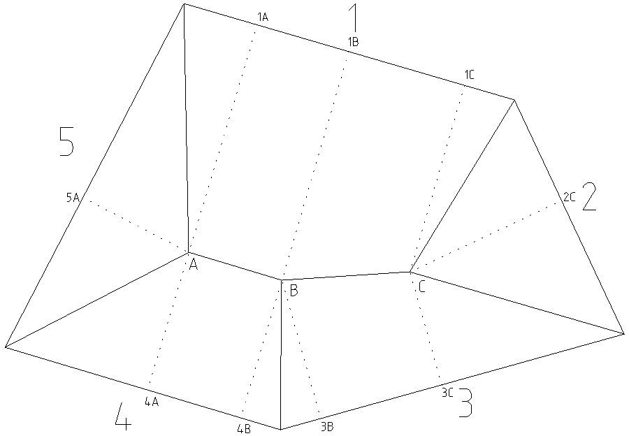

Raccord de combles - Technique
==============================

Le but est de trouver l'ensemble des points du toit, ainsi que les
arêtiers/noues et faitages associés.

Données du problème
-------------------

Un ensemble de murs et de pentes associées.

.. image:: ./imgs/plan.png
   :height: 530px

1 - Numérotation
----------------

Numéroter les versants dans le sens horaire.

2 - Raméneret
-------------

On va calculer le raméneret (la base) pour une hauteur choisie.

== == == == == ==
h  1  2  3  4  5
40 66 57 40 40 33
== == == == == ==

3 - Traçage projection
----------------------

On trace une droite parallèle à chaque côté à la distance calculée avec le
raméneret. On peut facilement le faire en traçant deux cercles de rayon
correspondant à la base calculée, et en dessinant à la règle la tangente
à ceux-ci.

On note les points des rencontres.

On peut effacer les traits de construction.

4 - Traçage arêtiers/noues
--------------------------

Avec les croisements naturels des côtés, on obtient donc 2 points et on peut
tracer l'arêtier ou la noue correspondante.

On trace les croupes trouvées (triangles), et seulement les plus petites
croupes. Dés qu'un arêtier est compris dans une croupe, on ne le prolonge plus
(on ne construit pas une croupe à côté d'une autre).

On voit que le côté 5 est complètement défini, ainsi que le côté 2.

5 - Fin du raccord
------------------

Pour terminer le raccord, on va trouver l'intersection entre les surfaces qui
communiquent.

Ici, il nous faudra les intersections entres les côtés 1 et 4, ainsi que les
côtés 1 et 3. On utilise la technique vue précédemment (avec éventuellement un
nouveau raméneret) pour trouver 2 points qui définissent l'arêtier associé.

On ferme petit à petit toutes les surfaces jusqu'à ce que le toit soit
complètement défini.

Pour y arriver, une bonne méthode consiste à s'imaginer en train de marcher sur
le faîtage, en partant d'une des rives. À chaque fois qu'on croise la droite
d'intersection des faces courantes et d'une nouvelle, on marque une pause, un
nouveau point de faîtage, puis on regarde les nouvelles faces qui se croisent
(faces par où on pourrait "descendre"). Cela trace le nouveau chemin à suivre
jusqu'à la prochaine intersection.

NOTE IMPORTANTE: On remarque que les intersections trouvées passent par le
sommet de la face 5 ainsi que de la face 2. Ceci est un moyen de vérification,
mais non un moyen de traçage. On ne doit pas s'aider des points existants!

Le raccord est désormais trouvé.

6 - Vérification
----------------

On nomme les points du toit trouvés (A, B, C, D, ...).
Pour chacun, on trace le chevron d'emprunt sur chacune des faces en contact
avec (point nommé 1A, 1B, 2C, ...)

On mesure ensuite chacune des bases associées, et on calcule la hauteur au point
donné. Elle doit être la même pour chacun des points sur chaque face.

On trie par point, pour repérer plus facilement.

v est la valeur mesurée sur le dessin. h est la hauteur calculée (h = p * v)

== === ======= ===
b  p   v       h
1A 0.6 172     104
4A 1   104     104
5A 1.2 86      104
1B 0.6 173     105
3B 1   105     105
4B 1   105     105
1C 0.6 141     85
2C 0.7 122     85
3C 1   85      85
== === ======= ===

Si les hauteurs sont les mêmes (tolérance 1-2cm), alors on a réussi le raccord.

7 - Herse
---------

À partir du tableau de vérification, on peut facilement calculer la herse pour
chaque face. Ceci correspond à la face couchée au sol, et donc, à la vraie
grandeur des arêtiers/noues.

On cherche H, qui est la hauteur de couronnement. À partir de la base et de
l'angle (α en degré), on peut la retrouver facilement.

On reporte l'angle (en degrés = arctan(pente)) dans le tableau de vérification
et on calcule la hauteur de couronnement.

== === ===== =======   === ===
b  p   α     v         h   H
1A 0.6 30.96 mesuré    hA  H1A
4A 1   45    mesuré    hA  H4A
5A 1.2 50.19 mesuré    hA  H5A
1B 0.6 30.96 mesuré    hB  H1B
3B 1   45    mesuré    hB  H3B
4B 1   45    mesuré    hB  H4B
1C 0.6 30.96 mesuré    hC  H2C
2C 0.7 34.99 mesuré    hC  H2C
3C 1   45    mesuré    hC  H3C
== === ===== =======   === ===

On peut tracer la herse en reportant la hauteur de couronnement trouvée sur le
chevron d'emprunt.

Pentes égales
-------------

Si les pentes sont égales, l'arêtier se trouve à la bissectrice de l'angle formé
par les 2 côtés.

Si les 2 côtés sont paralléles, et les pentes égales, l'arêtier se trouve à la
droite située pile entre les deux.

Note
----

De nouveau, il est important de préciser de ne jamais relier les arêtiers au
hasard. Chaque arêtier trouvé doit être le résultat de l'intersection de deux
surfaces.

Raccord de combles avancés
==========================

On peut avoir besoin de réaliser un raccord de combles avec une correction
d'altitude sur un des pans, ou bien une sablière de pente.

Dans ce cas là, la première étape est de tracer la sablière de dégauchissement,
qui correspond à la sablière qui serait située exactement à l'altitude 0.

Pour une correction d'altitude, on trace simplement une parallèle au pan
concerné (avec décalage correspondant au décalage d'altitude sur la vue en plan
(différence de hauteur/pente %)).

Pour une sablière de pente, la droite n'est plus parallèle. On obtient deux
points de celle-ci en prolongeant les côtés du pan (avec leurs pentes), ou bien
en croisant le faîtage avec le sol.

Dans l'exemple suivant, on fixe le faîtage, et les pentes. Le but est alors de
tracer la herse du versant 2.

1 - Chevron d'emprunt de la pente 1
-----------------------------------

On commence par tracer les CE de la pente 1 aux points de faîtage A et B.

Ceci nous permet de trouver l'altitude de ces points.

2 - Sablière dégauchissement
----------------------------

Ceci nous permet alors de trouver la pente des côtés gauche et droite
(parallèles), qui, bien que proche de celle des versants, n'est pas la même.

Une fois cela fait, on peut prolonger ces côtés pour atteindre l'altitude 0.
Cela nous donne alors la sablière de dégauchissement.

3 - CE pente 2
--------------

On peut alors tracer les chevrons d'emprunt de la pente 2.

4 - Herse
---------

Le tracé de herse se fait toujours en utilisant la sablière de dégauchissement.
On va alors projeter (calcul vue précédemment), en plus des points de faîtage,
les points d'extrémité du versant. On relie tous les points projetés, et on
obtient alors la herse du versant.

On notera qu'on utilise jamais la vue en plan de la sablière de pente pour
tracer la herse. Ceci, car son altitude n'est pas fixe.
